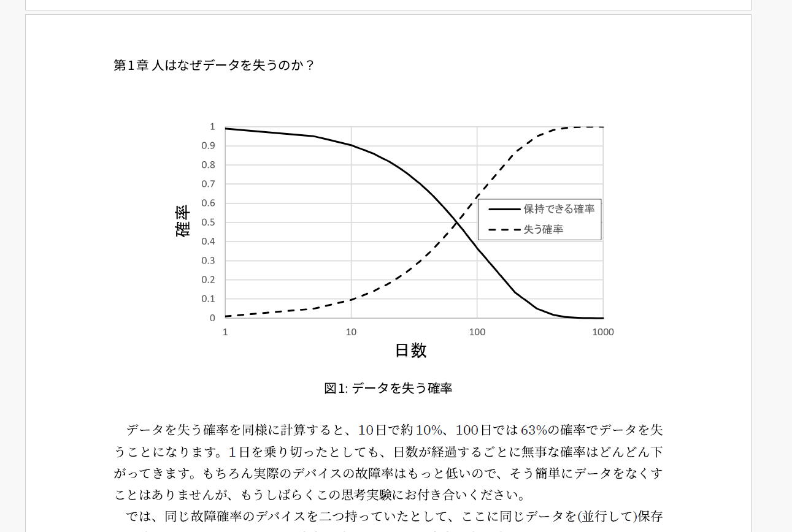

# 執筆のテンプレート

<div class="flush-right">
おやかた@oyakata2438　（必ず、執筆者名を入れてください。)
</div>

本章では、執筆テンプレートとして、原稿の書式を簡単に記載します。Markdownにて書いていただければOKですが、すべての書式に対応しているわけではありませんので、非実装書式については、意図しない表現となってしまうことがあり得ます。

## 命名規則

chap-(yourname)-(title).md
chap-oyakata-ltoutline.md

さらに、vivliostyle.config.jsに、そのファイル名を記載してください。(記載がないと、pdfに組み込まれません。)


## Markdownで書いてください

1章あたり、#1個の見出しは、1つとして下さい。2個以上使うと、章が分割されたり、変に採番されることがあります。

基本的な構造としては、##(2個)レベルが、節の見出しになります。ただし、４ページ程度の文章ですと、２-３個程度とすると見通しがよくなります。

### 文

Markdownにおける文では、
改行一つでは、
実際に改行は行われません。

### 強調・イタリック・取り消し線

**強調**や *イタリック* や、~~取り消し線~~などがあります。

普通使うのは **強調** くらいでしょうか？~~少しくだけたな文体なら~~取り消し線も使い勝手がいいかもしれません。


インラインコードとは、たとえば変数名 `worldCount` など「間違ってはいけない固有のもの」を強調するために使います。技術書の場合、変数名、クラス名などに使うことが多いでしょう。

このように、バッククォートで囲いましょう。バッククォートはJISキーボードなら `Shift+@` で入力できます。

### 3つまでは採番されます。

章>節>小節の構造となり、###は、1.2.3 XXについて、と、自動採番されます。

#### 4つだと、強調的にも使える。

* 箇条書きを行うとき
* 箇条書きの見出しをつけたいときにちょっとおススメ
	* 箇条書きのネストもできます

### 数字付きリスト

1. 1番目にすること
1. 2番目にすること
1. 3番目にすること

### コードブロック

コードブロックとは、ソースコードの提示などに使います。

```ts
// TypeScript
const hoge = "ほげ"
```

### 画像張り込み　

{width=90%}

原則、章ごとにフォルダを切って、その中にpng等の画像を格納してください。

長辺は1000ピクセル以上を強く推奨します。500ピクセル以下だと、印刷品質が低下する可能性が高くなります。

オプションパラメータ―として、{width=x%}で、幅の指定ができます。縦に長い画像を使うときなど、適宜調整してください。

### 表

Markdownでは表を書くことができます。ただしMarkdownの中でも表は「方言」に属するため、どのMarkdown処理系でも同じ書き方で使える都は限りません。ここではVivliostyleで書くためのVFMでの表について説明します。

名前|対応書式|拡張子|特徴
---|--------|-----|----
Re:VIEW|Re:VIEW専用フォーマット|.re|技術同人誌を書くのに、最も完成されたソフト
Vivliostyle|Markdown|.md|CSS組版で自由度の高い本を書けるソフト

### リンク
本文のキーワード[首相官邸](https://www.kantei.go.jp/)
にリンクを仕込むことはできますが、印刷する場合、リンクがあることに気付きづらいので、印刷版を前提とする本書では、脚注と併用することを強くお勧めします。


### 脚注

本文とはズレた内容や、リンク先などを脚注に出すことで、必要な情報を記載しつつ、本文の流れを維持できます。<span class="footnote">脚注を読むのが楽しみという人も一定いるかもしれませんが、読まない人も一定数いるのでご注意を。</span>。

なお、ハット[^hat] による脚注も利用可能ですが、「章末」にまとめられてしまいますので、本書では非推奨です。

[^hat]: サンカク記号での脚注も使えますが、章末にまとまるので非推奨

<div class="column">
<div class="column-title">コラムの書き方</div>

コラムとして囲み記事を作る場合は、コラムのクラスを使ってください。

本筋から外れる内容、補足などを入れるとよいでしょう。

</div>

#### 本章の執筆者

<div class="author-profile">
    
    <div>
        <div>
            <b>親方 </b>
            <a href="https://twitter.com/oyakata2438">X@otakata2438</a>
        </div>
        <div>
            サークル名：親方Project
        </div>
    </div>
</div>
<p style="margin-top: 0.5em; margin-bottom: 2em;">
ワンストップ本シリーズ企画・編集（一部執筆）してます。コミケと技術書典に出没。ついに技術書同人誌博覧会（技書博）のコアスタッフとして運営側に参加。技術書イベントが増えて嬉しいけれど、イベント多すぎて外出チケットと徳が不足気味。徳を貯めるべく、家事をこなしつつ、ラボに遊びに行ったり、飲み会や懇親会で著者を新規開拓したり。著者募集はいつでもやっていますので、ぜひご参加ください。
